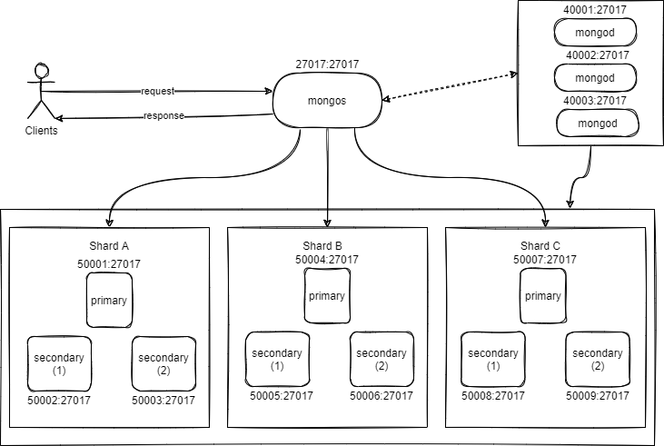

## Docker sharded mongodb setup

MongoDB is configured, start the instance (mongodb cluster) and wait for a minute to access MongoDB.



```
cd sharding/
docker-compose up -d
```

### Config servers

Start config servers (3 member replica set)
Initiate replica set

```
docker exec -it cfgsvr1 sh
mongo
```

```
rs.initiate(
  {
    _id: "cfgrs",
    configsvr: true,
    members: [
      { _id : 0, host : "cfgsvr1" },
      { _id : 1, host : "cfgsvr2" },
      { _id : 2, host : "cfgsvr3" }
    ]
  }
)

rs.status()
```

### Shard 1 servers

Start shard 1 servers (3 member replicas set)
Initiate replica set

```
docker exec -it shard1svr1 sh
mongo
```

```
rs.initiate(
  {
    _id: "shard1rs",
    members: [
      { _id : 0, host : "shard1svr1" },
      { _id : 1, host : "shard1svr2" },
      { _id : 2, host : "shard1svr3" }
    ]
  }
)

rs.status()
```

### Mongos Router

Start mongos query router

### Add shard to the cluster

Connect to mongos

```
docker exec -it mongos sh
mongo
```

Add shard

```
mongos> sh.addShard("shard1rs/shard1svr1,shard1svr2,shard1svr3")
mongos> sh.status()
```

## Adding another shard

### Shard 2 servers

Start shard 2 servers (3 member replicas set)
Initiate replica set

```
docker exec -it shard2svr1 sh
mongo
```

```
rs.initiate(
  {
    _id: "shard2rs",
    members: [
      { _id : 0, host : "shard2svr1" },
      { _id : 1, host : "shard2svr2" },
      { _id : 2, host : "shard2svr3" }
    ]
  }
)

rs.status()
```

### Add shard to the cluster

Connect to mongos

```
docker exec -it mongos sh
mongo
```

Add shard

```
mongos> sh.addShard("shard2rs/shard2svr1,shard2svr2,shard2svr3")
mongos> sh.status()
```

## Adding another shard

### Shard 3 servers

Start shard 3 servers (3 member replicas set)
Initiate replica set

```
docker exec -it shard3svr1 sh
mongo
```

```
rs.initiate(
  {
    _id: "shard3rs",
    members: [
      { _id : 0, host : "shard3svr1" },
      { _id : 1, host : "shard3svr2" },
      { _id : 2, host : "shard3svr3" }
    ]
  }
)

rs.status()
```

### Add shard to the cluster

Connect to mongos

```
docker exec -it mongos sh
mongo
```

Add shard

```
mongos> sh.addShard("shard3rs/shard3svr1,shard3svr2,shard3svr3")
mongos> sh.status()
```

Refer to this repository - https://github.com/justmeandopensource/learn-mongodb

For test data (user.json) - https://tools.publicis.sapient.com/confluence/display/PJMB/JIRA+Dashboard+2

mongodb uri for connection - mongodb://54.234.219.42/mycarsolution