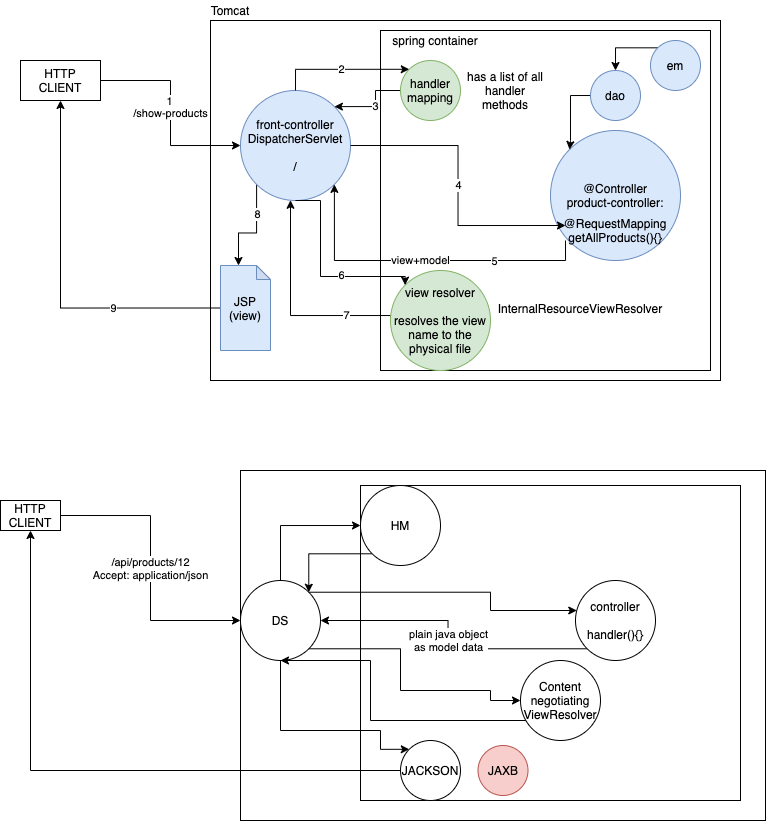
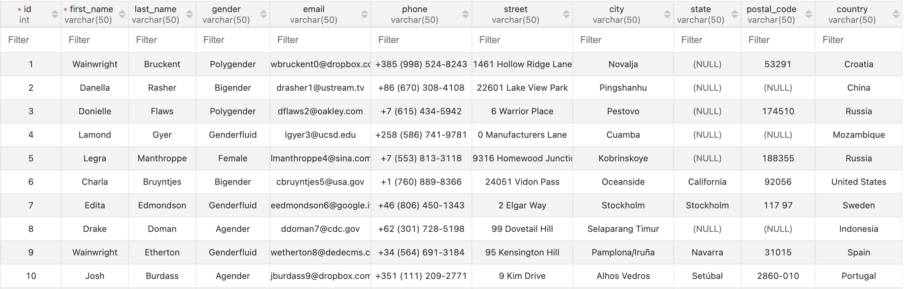
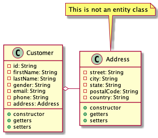

# ASDE Training

# Assignment

### Table: customers

### Entity classes

Hint: An entity class may have `embedded` objects

### Web application

Create a web application using Spring MVC to display the list of customers. The UI should show the following details in a tabular format:

-   Full name of the customer along with Mr or Ms (for male and female, and no title for other genders)
-   Email address
-   Phone number
-   Address with street/city/state-pincode/country in separate lines

The table should have only 20 rows, and should have options to view next/previous/first/last set of customers (pagination).
