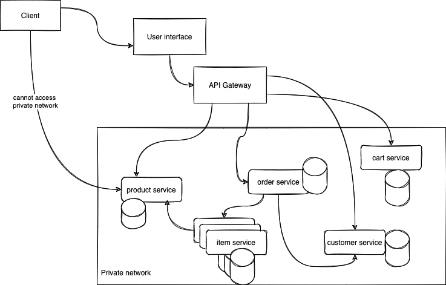
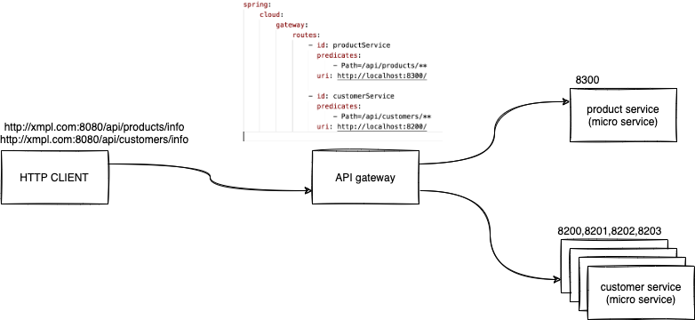
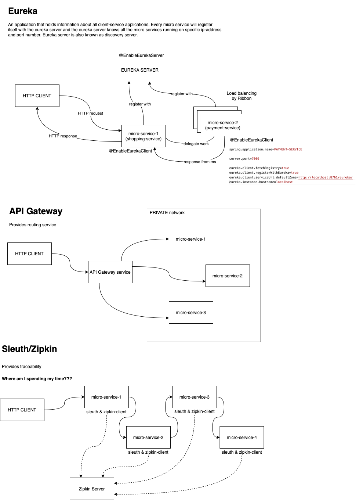

# ASDE Training

### TOC for Week 3 Day 4

-   Micro services overview
-   Architecture
-   Use cases and implementation
-   Do's and Dont's
-   Netflix OSS - Eureka/Ribbon/Zipkin/Hystrix
-   API gateway

## REST

-   REpresentational State Transfer
-   Transfer (exchange) of State (information) in different REpresentation (XML/JSON/CSV/Text/...)

Micro service Architecture is a **Service Oriented Architecture**. In the microservice architecture, there are a large number of (micro) services. By combining all the micro services, it constructs a big service. In the micro service architecture, all the services communicate with each other.

### Definition

According to _James Lewis_ and _Martin Fowler_, "The microservice architectural style is an approach to develop a single application as a suite of small services. Each microservice runs its process and communicates with lightweight mechanisms. These services are built around business capabilities and independently developed by fully automated deployment machinery."

### Principles of Microservices

There are the following principles of Microservices:

-   Single Responsibility principle
-   Modelled around business domain
-   Isolate Failure
-   Infrastructure automation
-   Deploy independently

### Advantages of Microservices

-   Microservices are self-contained, independent deployment module.
-   The cost of scaling is comparatively less than the monolithic architecture.
-   Microservices are independently manageable services. It can enable more and more services as the need arises. It minimizes the impact on existing service.
-   It is possible to change or upgrade each service individually rather than upgrading in the entire application.
-   Microservices allows us to develop an application which is organic (an application which latterly upgrades by adding more functions or modules) in nature.
-   It enables event streaming technology to enable easy integration in comparison to heavyweight interposes communication.
-   Microservices follows the single responsibility principle.
-   The demanding service can be deployed on multiple servers to enhance performance.
-   Less dependency and easy to test.
-   Dynamic scaling.
-   Faster release cycle.

### Disadvantages of Microservices

-   Microservices have all the associated complexities of the distributed system.
-   There is a higher chance of failure during communication between different services.
-   Difficult to manage a large number of services.
-   The developer needs to solve the problem, such as network latency and load balancing.
-   Complex testing over a distributed environment.

## Spring cloud

Spring Cloud provides tools for developers to quickly build some of the common patterns in distributed systems

-   configuration management
-   service discovery
-   circuit breakers
-   intelligent routing
-   micro-proxy
-   control bus
-   one-time tokens
-   global locks
-   leadership election
-   distributed sessions
-   cluster state

Coordination of distributed systems leads to boiler plate patterns, and using Spring Cloud, developers can quickly stand up services and applications that implement those patterns. They will work well in any distributed environment, including the developer’s own laptop, bare metal data centres, and managed platforms such as Cloud Foundry.

### Features

Spring Cloud focuses on providing good out of box experience for typical use cases and extensibility mechanism to cover others.

-   Distributed/versioned configuration
-   Service registration and discovery
-   Routing
-   Service-to-service calls
-   Load balancing
-   Circuit Breakers
-   Global locks
-   Leadership election and cluster state
-   Distributed messaging

