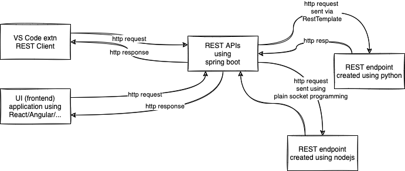
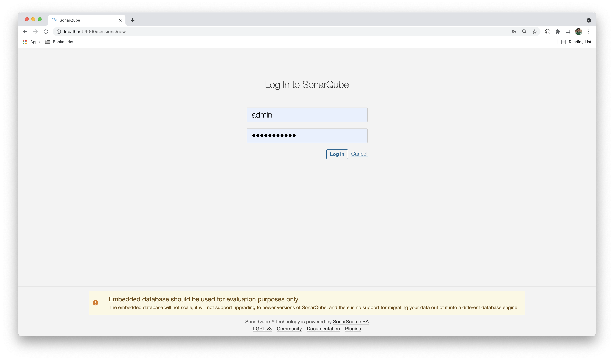
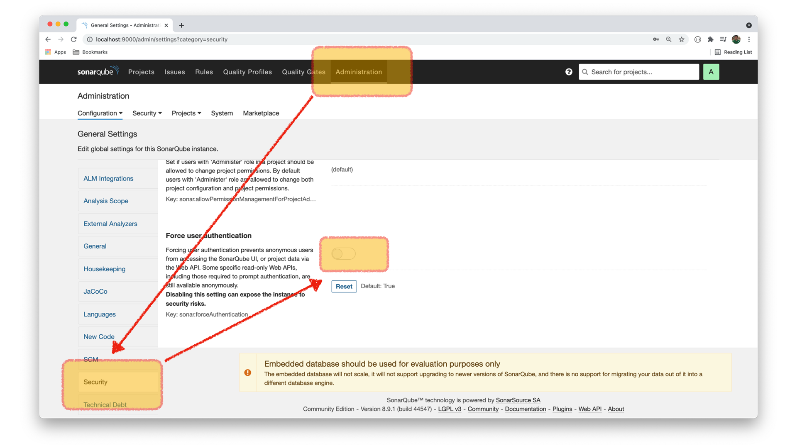

# ASDE Training

### TOC for Day 15

-   Swagger
-   Spring boot actuator
-   Testing and mockito
-   Securing REST endpoints
-   Soanarqube for quality control

### Swagger Setup

-   Add the following dependencies in `pom.xml`:

```xml
    <dependency>
        <groupId>io.springfox</groupId>
        <artifactId>springfox-swagger2</artifactId>
        <version>2.7.0</version>
    </dependency>
    <dependency>
        <groupId>io.springfox</groupId>
        <artifactId>springfox-swagger-ui</artifactId>
        <version>2.7.0</version>
    </dependency>
```

### Configuration:

-   Add `@EnableSwagger2` annotation
-   Create a `Docket` bean

```java
package com.sapient;

import org.springframework.context.annotation.Bean;
import org.springframework.context.annotation.Configuration;

import springfox.documentation.builders.RequestHandlerSelectors;
import springfox.documentation.spi.DocumentationType;
import springfox.documentation.spring.web.plugins.Docket;
import springfox.documentation.swagger2.annotations.EnableSwagger2;

@Configuration
@EnableSwagger2
public class SwaggerConfiguration {
    @Bean
    public Docket docket() {
        return new Docket(DocumentationType.SWAGGER_2).select().apis(RequestHandlerSelectors.basePackage("com.sapient"))
                .build();
    }
}

```

-   Start the application
-   Visit `http://localhost:8080/swagger-ui.html`

<hr />

### Actuator

-   Add the following dependency in `pom.xml`:

```xml
    <dependency>
        <groupId>org.springframework.boot</groupId>
        <artifactId>spring-boot-starter-actuator</artifactId>
    </dependency>
```

-   Optional: add the following properties in `application.properties` file:

```properties
management.server.port=9876
management.endpoints.web.exposure.include=health,env,beans
```

Visit:

-   http://localhost:9876/actuator
-   http://localhost:9876/actuator/health
-   http://localhost:9876/actuator/env
-   http://localhost:9876/actuator/beans

### RestTemplate



### Starting Sonarqube server using Docker

```sh
docker run -dp 9000:9000 --name sonarserver -v sonar:/opt/sonarqube/data sonarqube
```



-   Default username/password is admin/admin.
-   You will be asked to change the password.
-   After that you have to disable "Force user authentication", so that we can publish our projects to the sonarqbe server.



Add the following properties in pom.xml file:

```xml
	<properties>
		<java.version>1.8</java.version>
		<sonar.exclusions>
			src/**/*Application.java, src/**/entity/*.java, src/**/*Exception.java
		</sonar.exclusions>
		<sonar.java.binaries>
			target
		</sonar.java.binaries>
		<sonar.tests>
			src/test
		</sonar.tests>
	</properties>
```

Add the jacoco plugin for code coverage analysis:

```xml
    <plugin>
        <groupId>org.jacoco</groupId>
        <artifactId>jacoco-maven-plugin</artifactId>
        <version>0.8.2</version>
        <executions>
            <execution>
                <goals>
                    <goal>prepare-agent</goal>
                </goals>
            </execution>
            <execution>
                <id>report</id>
                <phase>test</phase>
                <goals>
                    <goal>report</goal>
                </goals>
            </execution>
        </executions>
    </plugin>
```

And to publish your project for analysis to the sonarqube server, run the command:

```sh
mvn clean test sonar:sonar
```
