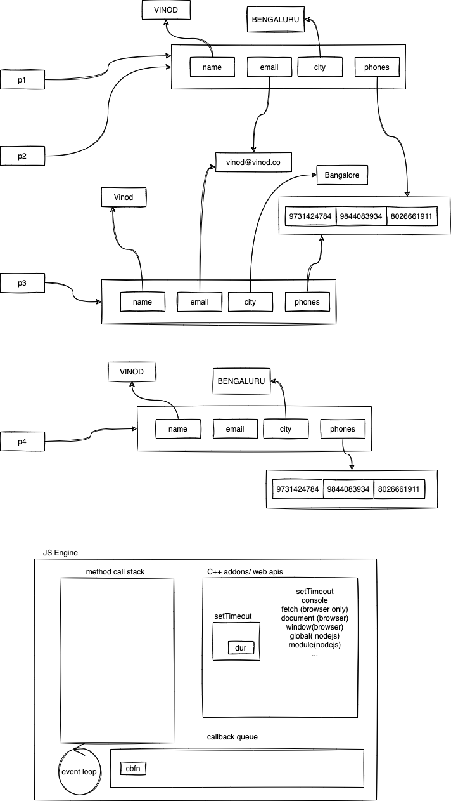

# ASDE Training

### TOC for Week 4 Day 2:

-   Node overview and setup
-   npm and package.json walkthrough
-   modules and ES-next/TypeScript overview
-   Promise, async/await
-   Unit testing basics in JavaScript

