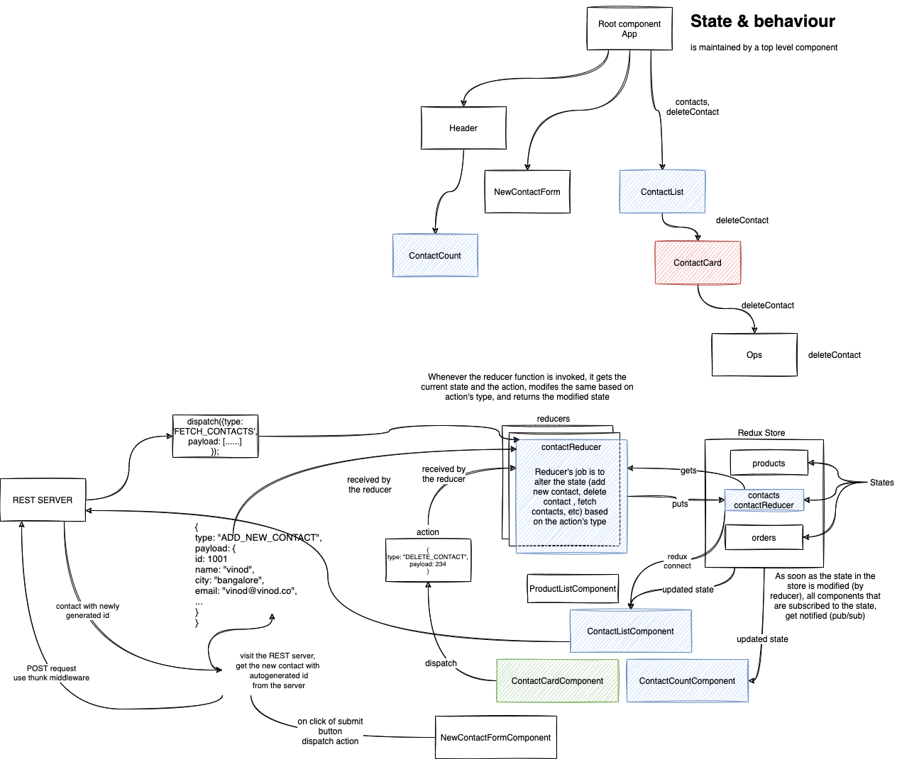

# ASDE Training

### TOC for Week 4 Day 5:

-   State management issues
-   Redux
-   React and Redux

### Reducers

contactReducer.js:

```javascript
export default function contactReducer(state = [], action = {}) {
    switch (action.type) {
        case FETCH_CONTACTS: {
            return [...action.payload];
        }
        case ADD_NEW_CONTACT: {
            // action.payload ---> represents the new contact to be added
            const contacts = [...state]; // local copy of state
            contacts.push({ ...action.payload }); // push a shallow copy of the payload (which is a new contact)
            return [...contacts]; // return a shallow copy of modified state
        }
        case DELETE_CONTACT: {
            // action.payload ---> represents the id of the contact to be deleted
            const contacts = [...state]; // local copy of state
            const index = contacts.findIndex((c) => c.id === action.payload);
            contacts.splice(index, 1);
            return [...contacts];
        }
        default:
            return state;
    }
}
```

rootReducer.js:

```javascript
import { combineReducers } from 'redux';
import contactReducer from './contactReducer';

export default combineReducers({
    contactReducer, // represents a state in the store
    // list of all other reducers you eventuall will have
});
```

### Actions (thunk)

contactActions.js:

```javascript
import axios from 'axios';
import { ADD_NEW_CONTACT, DELETE_CONTACT, FETCH_CONTACTS } from './actionTypes';

const baseUrl = 'http://localhost:8080/contacts/';

export function fetchContacts() {
    // return a function which is called by thunk,
    // and thunk will pass "dispatch" method as the argument,
    // so that we can disapatch an action
    return async function dispatchAction(dispatch) {
        // send a GET request to the REST server to get the data
        const { data } = await axios.get(baseUrl);
        dispatch({ type: FETCH_CONTACTS, payload: data });
    };
}

export const addNewContact = (contact) => async (dispatch) => {
    // send a POST request to the REST server to add new contact
    const { data } = await axios.post(baseUrl, contact);
    dispatch({ type: ADD_NEW_CONTACT, payload: data });
};

export const deleteContact = (id) => async (dispatch) => {
    await axios.delete(baseUrl + id);
    dispatch({ type: DELETE_CONTACT, payload: id });
};
```

### Creating store

App.js:

```javascript
const store = createStore(
    rootReducer,
    composeWithDevTools(applyMiddleware(thunk))
);

function App() {
    return (
        <Provider store={store}>
            <Header />
            <div className='container'>
                <div className='row'>
                    <div className='col-4 col-xs-12'>
                        <NewContactForm />
                    </div>
                    <div className='col-8 col-xs-12'>
                        <ContactList a='asd' b='qwe' c='ert' />
                    </div>
                </div>
            </div>
        </Provider>
    );
}

export default App;
```

### Connecting components:

ContactList.js:

```javascript
// connect() returns a function, that takes ContactList as arguments, and
// returns a new component (higher order component)
// const hoc = connect();
// const newComp = hoc(ContactList);
// export default newComp;

// typically there are 2 parameters for the connect function
// 1. what is the state you want from the store (in our case contactReducer)
const stateAsProps = (store) => {
    return { contacts: store.contactReducer };
};
// 2. which action method you want thunk to call (in our case actions/contactActions.js#fetchContacts)
const actionsAsProps = { getAllContactsFromRestServer: fetchContacts };
// when we call getAllContactsFromRestServer(), redux will call fetchContacts()
export default connect(stateAsProps, actionsAsProps)(ContactList);
```


