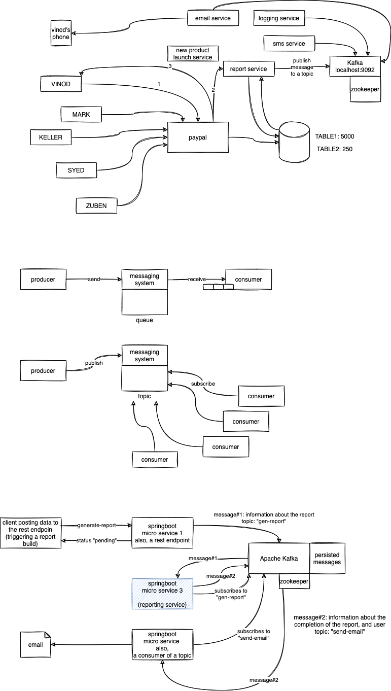

# ASDE Training

### To run the code

-   cd into the `kafka-springboot-demo` folder
-   run the build.sh (on Windows, build.bat)
-   once done, run the command `docker compose up -d`
-   send the POST request using the `requests.http` file

